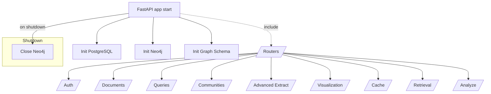
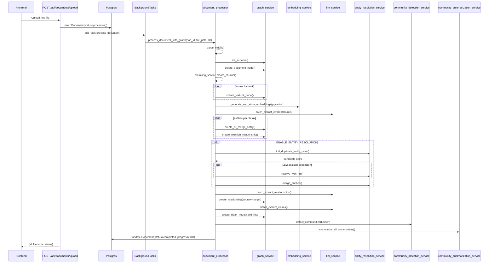
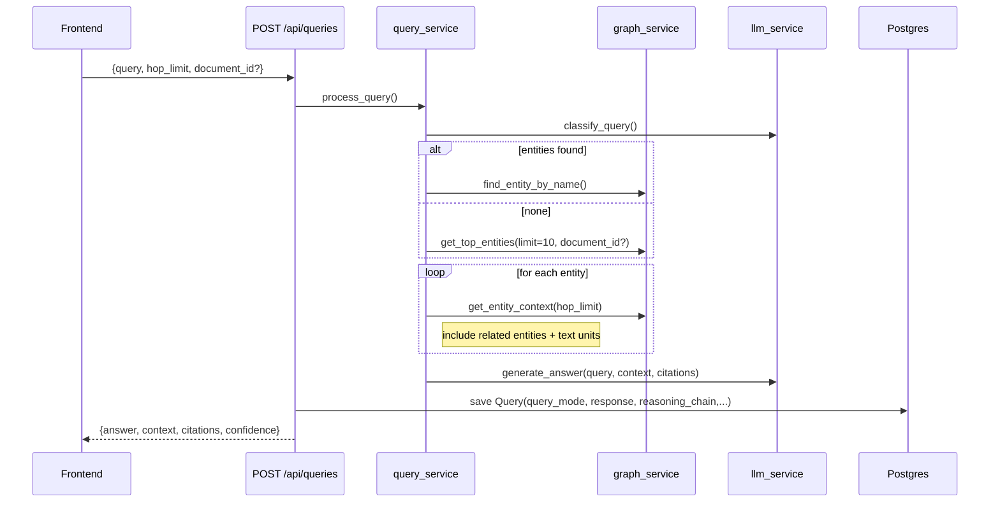

### System Flow (GraphToG Backend)

This document visualizes the current backend flows discovered in `app/main.py`, `api/endpoints/*`, and `services/*`.

#### Application Lifecycle



#### Document Upload and Processing (GraphRAG Pipeline)



#### Incremental Reprocessing

```mermaid
flowchart LR
    U[PUT /api/documents/{id}/update] --> P[Parse new content]
    P --> H[Compute SHA256 hash]
    H -- "unchanged" --> SKIP[Skip reprocessing]
    H -- "changed" --> M[Mark status=processing; ++version]
    M --> A[Get affected communities]
    A --> C[Delete old graph data for document]
    C --> R[Re-run full pipeline]
    R --> I[Incremental community detection (if any affected)]
    I --> F[Update metadata and finish]
```

#### Query Processing (Entity-centric GraphRAG)



#### Global Query with Map-Reduce (Summaries-based)

```mermaid
flowchart TD
    A[POST /api/queries/global] --> B[retrieval_service.retrieve_global_context(use_summaries=true)]
    B -->|no summaries| E[Error: process documents first]
    B --> C{Use Map-Reduce?}
    C -- Yes --> M1[Map: split communities into batches]
    M1 --> M2[LLM summarize_community_batch per batch]
    M2 --> R[Reduce: synthesize_final_answer]
    C -- No --> S[Assemble summaries into context]
    S --> R
    R --> O[Return answer + confidence + metadata]
```


