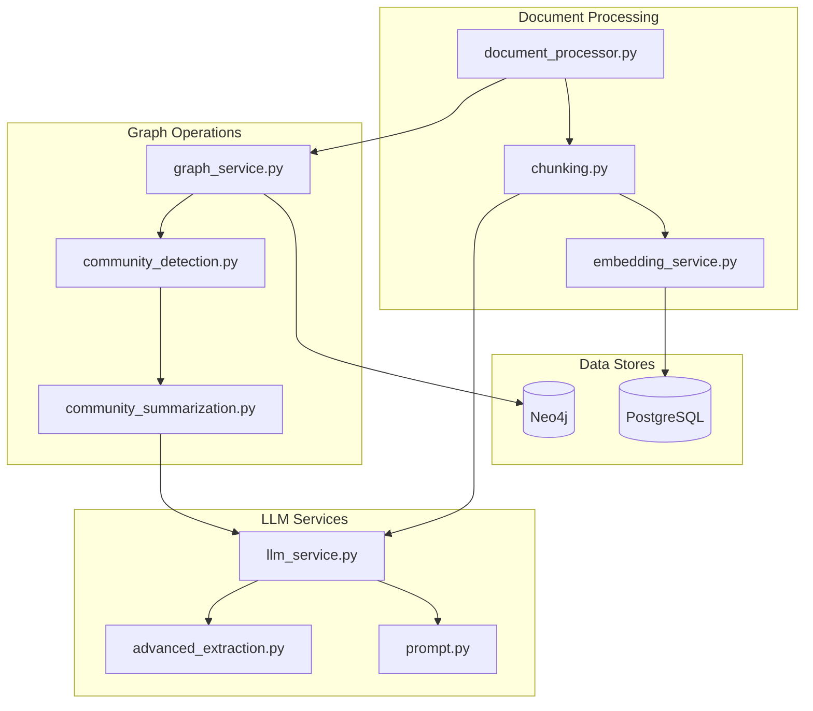
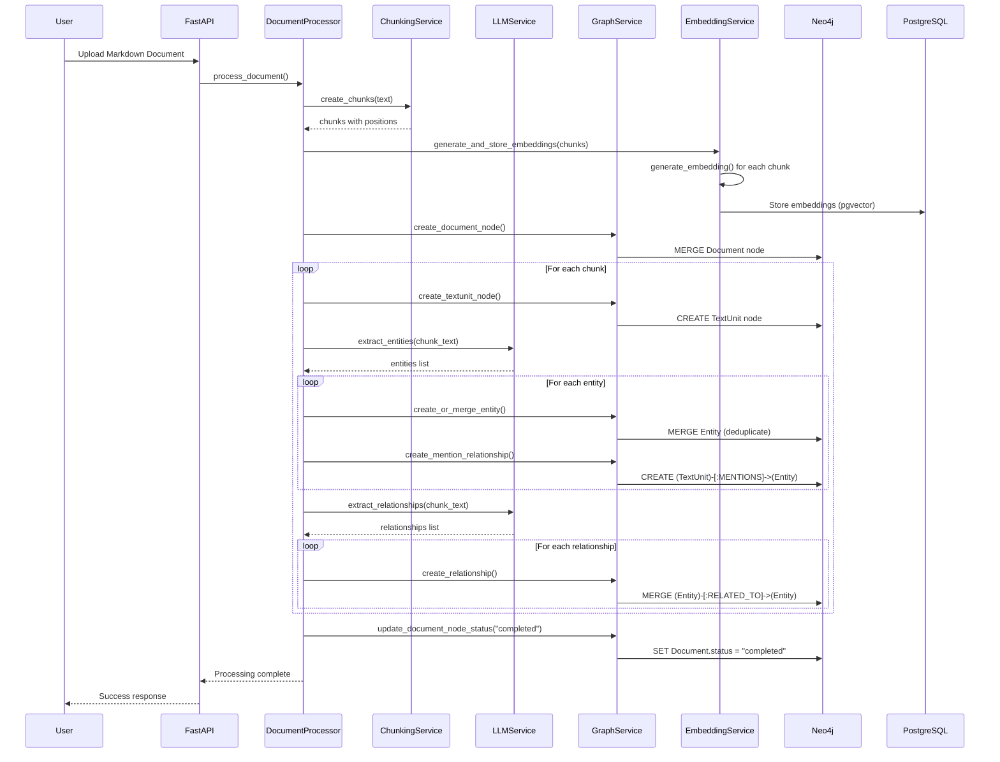
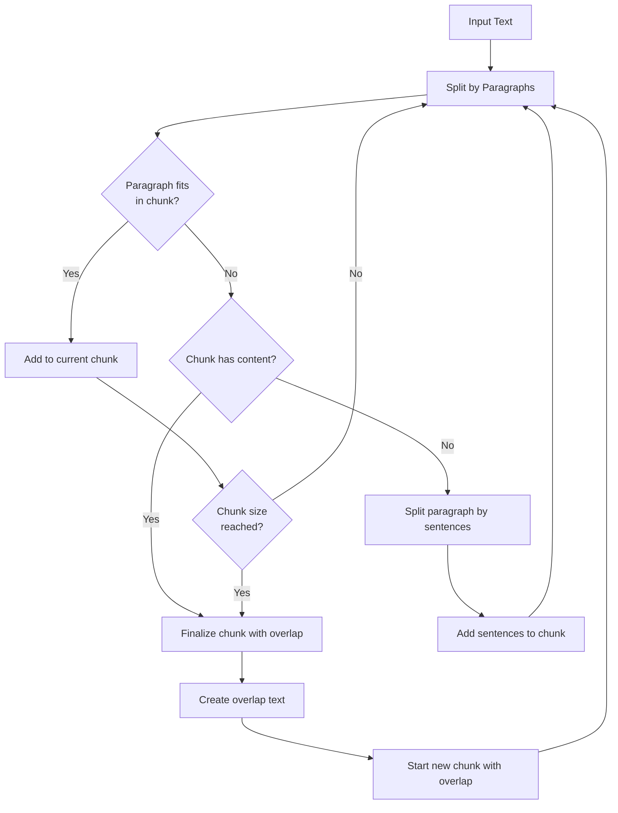
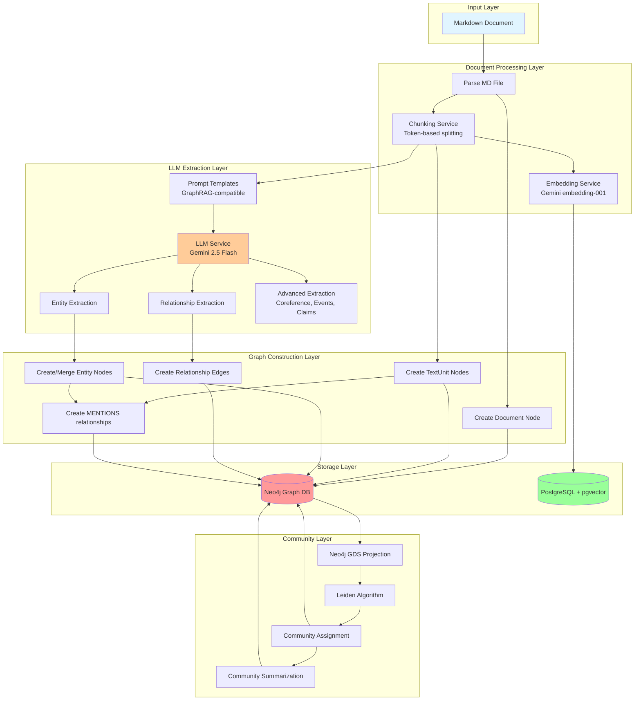
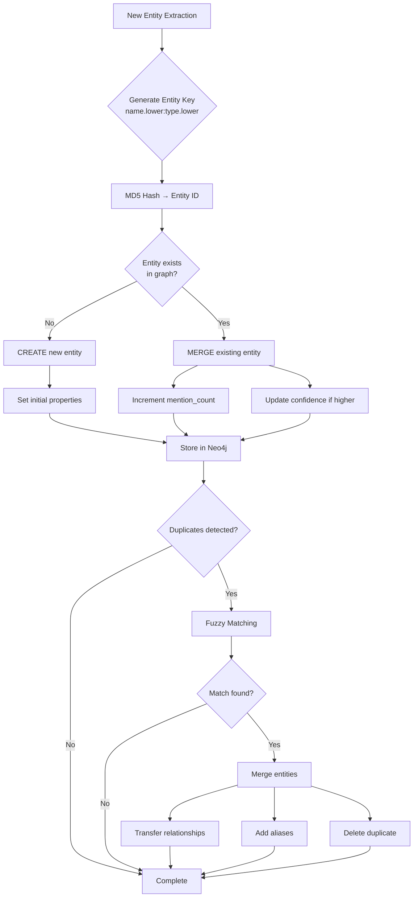
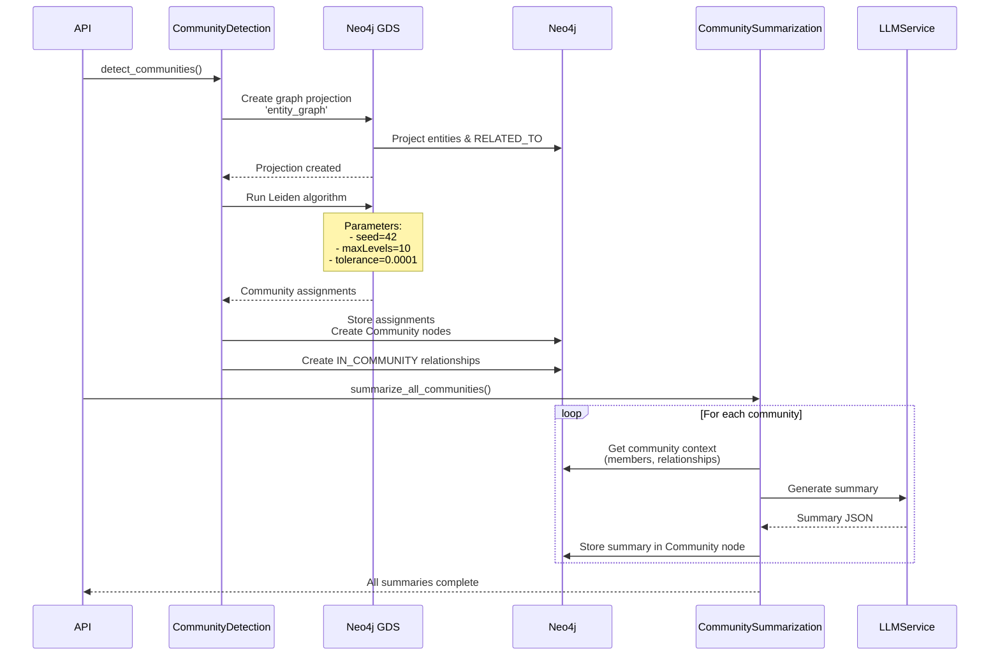

# Knowledge Graph Construction Analysis

## Table of Contents
1. [Overview](#overview)
2. [Architecture Components](#architecture-components)
3. [Construction Pipeline](#construction-pipeline)
4. [Entity & Relationship Extraction](#entity--relationship-extraction)
5. [Graph Schema](#graph-schema)
6. [Community Detection](#community-detection)
7. [Text Processing & Embeddings](#text-processing--embeddings)
8. [Entity Resolution](#entity-resolution)
9. [Advanced Extraction Features](#advanced-extraction-features)
10. [Data Flow Diagrams](#data-flow-diagrams)

---

## Overview

The GraphToG knowledge graph construction system implements a **GraphRAG-compatible pipeline** that transforms unstructured markdown documents into a rich, queryable knowledge graph stored in Neo4j. The system combines:

- **LLM-powered extraction** using Google Gemini 2.5 Flash
- **Token-aware text chunking** with configurable overlap
- **Semantic embeddings** via Gemini embedding-001 (3072 dimensions)
- **Graph-based storage** in Neo4j with optimized indexes
- **Community detection** using Leiden algorithm
- **Entity resolution** with fuzzy matching and deduplication
- **Advanced extraction** including coreference resolution, events, and claims

**Key Design Principles:**
- Microsoft GraphRAG methodology compliance
- Incremental updates support
- Hierarchical community structure
- Multi-hop reasoning optimization (ToG)
- Scalable vector search with pgvector

---

## Architecture Components

### Core Services



### Service Responsibilities

| Service | Purpose | Key Methods |
|---------|---------|-------------|
| `graph_service.py` | Neo4j operations, entity/relationship CRUD | `create_or_merge_entity()`, `create_relationship()`, `init_schema()` |
| `chunking.py` | Token-based text segmentation | `create_chunks()`, `count_tokens()` |
| `embedding_service.py` | Generate & store embeddings | `generate_embedding()`, `generate_and_store_embeddings()` |
| `llm_service.py` | LLM API calls with retry logic | `extract_entities()`, `extract_relationships()` |
| `advanced_extraction.py` | Few-shot learning, coreference | `extract_with_few_shot()`, `resolve_coreferences()` |
| `community_detection.py` | Leiden algorithm execution | `detect_communities()`, `detect_communities_incrementally()` |
| `community_summarization.py` | LLM-based community summaries | `generate_community_summary()` |
| `prompt.py` | GraphRAG prompt templates | `build_graph_extraction_prompt()`, `build_claim_extraction_prompt()` |

---

## Construction Pipeline

### High-Level Workflow



### Detailed Steps

#### 1. Document Upload & Parsing
```python
# From document_processor.py (conceptual)
async def process_document(file_path: str, document_id: UUID):
    # Read markdown file
    content = read_file(file_path)

    # Create document node in Neo4j
    graph_service.create_document_node(
        document_id=str(document_id),
        document_name=filename,
        file_path=file_path
    )
```

#### 2. Text Chunking
```python
# From chunking.py
chunking_service = ChunkingService(
    chunk_size=1000,      # tokens per chunk
    overlap_size=300,     # overlap between chunks
    min_chunk_size=100    # minimum chunk size
)

chunks = chunking_service.create_chunks(text)
# Returns: [(chunk_text, start_char, end_char), ...]
```

**Chunking Strategy:**
- **Token-based sizing** using tiktoken (GPT-3.5 tokenizer)
- **Paragraph-aware** splitting to preserve semantic boundaries
- **Sentence fallback** for oversized paragraphs
- **Overlap** to maintain context across chunks

#### 3. Embedding Generation
```python
# From embedding_service.py
embedding_service = EmbeddingService()

result = await embedding_service.generate_and_store_embeddings(
    db=session,
    document_id=document_id,
    chunks=[{
        "chunk_id": "chunk_001",
        "text": "Chunk text...",
        "start_char": 0,
        "end_char": 100
    }]
)
# Returns: {"embedded": 10, "skipped": 0}
```

**Embedding Details:**
- **Model:** `gemini-embedding-001` (3072 dimensions)
- **Task type:** `SEMANTIC_SIMILARITY`
- **Storage:** PostgreSQL with pgvector extension
- **Rate limiting:** 50ms delay between requests
- **Retry logic:** Exponential backoff (3 retries max)

#### 4. Entity Extraction (LLM)
```python
# From llm_service.py
llm_service = LLMService()

entities = llm_service.extract_entities(
    text=chunk_text,
    entity_types=["PERSON", "ORGANIZATION", "LOCATION", "EVENT"]
)
# Returns: [
#     {"name": "John Doe", "type": "PERSON", "description": "CEO of...", "confidence": 0.95},
#     ...
# ]
```

**Prompt Template** (from `prompt.py`):
```python
GRAPH_EXTRACTION_PROMPT_TEMPLATE = """
-Goal-
Given a text document and entity types, identify all entities and relationships.

-Steps-
1. Identify entities with: name, type, description
2. Identify relationships with: source, target, description, strength
3. Return output as delimited tuples
4. Output {completion_delimiter} when finished

Entity_types: {entity_types}
Text: {input_text}
Output:
"""
```

#### 5. Graph Node Creation
```python
# From graph_service.py
entity_id = graph_service.create_or_merge_entity(
    name="John Doe",
    entity_type="PERSON",
    description="CEO of Acme Corp",
    confidence=0.95
)

# Creates/updates entity with deduplication
# Entity ID: MD5 hash of "john doe:person" (case-insensitive)
```

**Deduplication Logic:**
```cypher
MERGE (e:Entity {name: $name, type: $entity_type})
ON CREATE SET
    e.id = $entity_id,
    e.description = $description,
    e.confidence = $confidence,
    e.mention_count = 1
ON MATCH SET
    e.mention_count = e.mention_count + 1,
    e.confidence = CASE WHEN $confidence > e.confidence
                   THEN $confidence ELSE e.confidence END
```

#### 6. Relationship Extraction
```python
# From llm_service.py
relationships = llm_service.extract_relationships(
    text=chunk_text,
    entity_names=["John Doe", "Acme Corp"]  # Optional focus
)
# Returns: [
#     {
#         "source": "John Doe",
#         "target": "Acme Corp",
#         "type": "WORKS_AT",
#         "description": "John Doe is CEO of Acme Corp",
#         "confidence": 0.9
#     }
# ]
```

#### 7. Relationship Graph Creation
```python
# From graph_service.py
graph_service.create_relationship(
    source_entity_id="abc123",
    target_entity_id="def456",
    relationship_type="RELATED_TO",
    description="John Doe is CEO of Acme Corp",
    confidence=0.9
)
```

**Relationship Storage:**
```cypher
MERGE (source)-[r:RELATED_TO]->(target)
ON CREATE SET
    r.description = $description,
    r.confidence = $confidence,
    r.created_at = datetime()
ON MATCH SET
    r.confidence = CASE WHEN $confidence > r.confidence
                   THEN $confidence ELSE r.confidence END
```

---

## Entity & Relationship Extraction

### GraphRAG-Compatible Extraction

The system follows **Microsoft GraphRAG** methodology for entity and relationship extraction:

#### Entity Extraction Prompt Structure
```python
def build_graph_extraction_prompt(text: str, entity_types: List[str]):
    """
    GraphRAG-compliant prompt for joint entity + relationship extraction

    Format:
    1. Extract entities as:
       ("entity"|name|type|description)

    2. Extract relationships as:
       ("relationship"|source|target|description|strength)

    3. Use ||| as tuple delimiter
    4. Use newline as record delimiter
    5. End with <COMPLETE>
    """
```

#### Example Extraction Output
```text
("entity"|||JOHN DOE|||PERSON|||CEO and founder of Acme Corporation)
("entity"|||ACME CORPORATION|||ORGANIZATION|||Technology company founded in 2020)
("relationship"|||JOHN DOE|||ACME CORPORATION|||John Doe is the CEO of Acme Corporation|||9)
<COMPLETE>
```

### LLM Service Implementation

```python
class LLMService:
    def __init__(self):
        self.model_name = "gemini-2.5-flash"
        self.max_retries = 3
        self.rate_limit_delay = 1.0  # seconds between requests

    def extract_entities(self, text: str, entity_types: List[str]) -> List[Dict]:
        """Extract entities using GraphRAG prompt template"""
        prompt = build_graph_extraction_prompt(text, entity_types)
        response = self._call_llm(prompt)
        entities = self._parse_extraction_response(response)
        return entities

    def extract_relationships(self, text: str, entity_names: List[str]) -> List[Dict]:
        """Extract relationships with optional entity focus"""
        prompt = build_relationship_extraction_prompt(text, entity_names)
        response = self._call_llm(prompt)
        relationships = self._parse_extraction_response(response)
        return relationships

    def _parse_extraction_response(self, response: str) -> List[Dict]:
        """Parse GraphRAG tuple format into structured data"""
        # Handle ("entity"|||NAME|||TYPE|||DESC) format
        # Handle ("relationship"|||SRC|||TGT|||DESC|||STRENGTH) format
```

### Advanced Extraction Features

The `advanced_extraction.py` service provides:

#### 1. Few-Shot Entity Extraction
```python
advanced_extraction_service.extract_with_few_shot(
    text="Apple Inc. was founded by Steve Jobs in 1976.",
    entity_types=["ORGANIZATION", "PERSON"]
)
# Uses few-shot examples to improve extraction quality
```

#### 2. Coreference Resolution
```python
result = advanced_extraction_service.resolve_coreferences(
    text="John works at Microsoft. He is a software engineer."
)
# Returns: {
#     "coreferences": [{"mention": "He", "referent": "John", "type": "pronoun"}],
#     "entities": ["John", "Microsoft"]
# }
```

#### 3. Event Extraction
```python
events = advanced_extraction_service.extract_events(
    text="The conference was held on March 15, 2024 in San Francisco."
)
# Returns: {
#     "events": [{
#         "event": "conference",
#         "date": "2024-03-15",
#         "location": "San Francisco",
#         "importance": "medium"
#     }]
# }
```

#### 4. Attribute Extraction
```python
attributes = advanced_extraction_service.extract_attributes(
    entity_name="Apple Inc.",
    text="Apple Inc. is a technology company founded in 1976..."
)
# Returns: {
#     "entity": "Apple Inc.",
#     "attributes": {
#         "description": "Technology company",
#         "properties": ["founded in 1976"],
#         "characteristics": ["innovative", "consumer-focused"]
#     }
# }
```

---

## Graph Schema

### Node Types

#### Document Node
```cypher
CREATE (d:Document {
    id: "uuid-string",
    name: "document.md",
    file_path: "/path/to/document.md",
    created_at: datetime(),
    status: "completed"  // pending|processing|completed|failed
})
```

#### TextUnit Node (Chunk)
```cypher
CREATE (t:TextUnit {
    id: "chunk_001",
    document_id: "uuid-string",
    text: "Chunk content...",
    start_char: 0,
    end_char: 1000,
    created_at: datetime()
})
```

#### Entity Node
```cypher
CREATE (e:Entity {
    id: "md5-hash-16-chars",
    name: "John Doe",
    type: "PERSON",
    description: "CEO of Acme Corp",
    confidence: 0.95,
    mention_count: 5,
    created_at: datetime(),
    updated_at: datetime()
})
```

#### Community Node
```cypher
CREATE (c:Community {
    id: 12345,  // Community ID from Leiden algorithm
    level: 0,   // Hierarchy level (0=base, 1=higher)
    summary: "Community of tech companies...",
    key_themes: "technology,innovation",
    createdAt: datetime(),
    summary_timestamp: datetime()
})
```

### Relationship Types

#### PART_OF (TextUnit → Document)
```cypher
CREATE (t:TextUnit)-[:PART_OF]->(d:Document)
```

#### MENTIONS (TextUnit → Entity)
```cypher
CREATE (t:TextUnit)-[r:MENTIONS {
    created_at: datetime()
}]->(e:Entity)
```

#### RELATED_TO (Entity → Entity)
```cypher
CREATE (e1:Entity)-[r:RELATED_TO {
    description: "works at",
    confidence: 0.9,
    created_at: datetime(),
    updated_at: datetime()
}]->(e2:Entity)
```

#### IN_COMMUNITY (Entity → Community)
```cypher
CREATE (e:Entity)-[r:IN_COMMUNITY {
    confidence: 0.95,
    timestamp: datetime(),
    community_level: 0
}]->(c:Community)
```

### Constraints & Indexes

From `graph_service.init_schema()`:

```cypher
-- Constraints (Uniqueness)
CREATE CONSTRAINT entity_name_type IF NOT EXISTS
FOR (e:Entity) REQUIRE (e.name, e.type) IS UNIQUE;

CREATE CONSTRAINT document_name IF NOT EXISTS
FOR (d:Document) REQUIRE d.name IS UNIQUE;

CREATE CONSTRAINT textunit_id IF NOT EXISTS
FOR (t:TextUnit) REQUIRE t.id IS UNIQUE;

CREATE CONSTRAINT community_id IF NOT EXISTS
FOR (c:Community) REQUIRE c.id IS UNIQUE;

-- Performance Indexes
CREATE INDEX entity_type IF NOT EXISTS
FOR (e:Entity) ON (e.type);

CREATE INDEX entity_name_lookup IF NOT EXISTS
FOR (e:Entity) ON (e.name);

CREATE INDEX entity_confidence IF NOT EXISTS
FOR (e:Entity) ON (e.confidence);

CREATE INDEX entity_mention_count IF NOT EXISTS
FOR (e:Entity) ON (e.mention_count);

CREATE INDEX textunit_doc_id IF NOT EXISTS
FOR (t:TextUnit) ON (t.document_id);

-- ToG Optimization Indexes
CREATE INDEX entity_document IF NOT EXISTS
FOR (e:Entity) ON (e.document_id);

CREATE INDEX relation_type IF NOT EXISTS
FOR ()-[r:RELATES_TO]-() ON (r.type);

CREATE INDEX relation_confidence IF NOT EXISTS
FOR ()-[r:RELATES_TO]-() ON (r.confidence);
```

---

## Community Detection

### Leiden Algorithm Implementation

The system uses **Neo4j GDS (Graph Data Science)** Leiden algorithm for hierarchical community detection:

```python
class CommunityDetectionService:
    def detect_communities(self, seed=42, max_iterations=10):
        """
        Detect communities using Leiden algorithm

        Steps:
        1. Create GDS graph projection
        2. Run Leiden algorithm
        3. Store community assignments
        4. Generate hierarchical levels
        """
```

#### Graph Projection
```cypher
CALL gds.graph.project(
    'entity_graph',
    'Entity',
    {
        RELATED_TO: {orientation: 'UNDIRECTED'}
    }
)
```

#### Leiden Execution
```cypher
CALL gds.leiden.stream(
    'entity_graph',
    {
        randomSeed: 42,
        includeIntermediateCommunities: true,
        tolerance: 0.0001,
        maxLevels: 10,
        concurrency: 4
    }
)
YIELD nodeId, communityId, intermediateCommunityIds
RETURN gds.util.asNode(nodeId).name AS entity_name,
       communityId,
       intermediateCommunityIds
ORDER BY communityId
```

#### Community Assignment Storage
```python
def _store_community_assignments(session, results):
    """
    Store community assignments with hierarchy

    For each entity:
    - Create Community node (if not exists)
    - Create IN_COMMUNITY relationship
    - Store hierarchy level (0=base, 1+=higher)
    - Set confidence score based on algorithm
    """
```

```cypher
MATCH (e:Entity {name: $entity_name})
MERGE (c:Community {id: $community_id})
ON CREATE SET
    c.createdAt = datetime(),
    c.level = $community_level,
    c.summary = ""
MERGE (e)-[r:IN_COMMUNITY]->(c)
SET r.confidence = 0.95,
    r.timestamp = datetime(),
    r.community_level = $community_level
```

### Incremental Community Detection

For document updates, the system supports **incremental community detection** to avoid full recomputation:

```python
def detect_communities_incrementally(affected_entity_ids: List[str]):
    """
    Strategy:
    1. Remove old community assignments for affected entities
    2. Get 1-hop neighbors (entities might be affected)
    3. Create subgraph projection for affected entities + neighbors
    4. Run Leiden on subgraph only
    5. Update community assignments
    6. Clean up orphaned communities
    """
```

#### Affected Entities Expansion
```cypher
MATCH (e:Entity)
WHERE e.id IN $entity_ids
OPTIONAL MATCH (e)-[r:RELATED_TO]-(neighbor:Entity)
WITH COLLECT(DISTINCT e.id) + COLLECT(DISTINCT neighbor.id) AS all_entity_ids
UNWIND all_entity_ids AS entity_id
WITH DISTINCT entity_id
WHERE entity_id IS NOT NULL
RETURN COLLECT(entity_id) AS expanded_entity_ids
```

#### Subgraph Projection
```cypher
CALL gds.graph.project.cypher(
    'affected_subgraph_42',
    'MATCH (e:Entity) WHERE e.id IN $entity_ids RETURN id(e) AS id',
    'MATCH (e1:Entity)-[r:RELATED_TO]-(e2:Entity)
     WHERE e1.id IN $entity_ids AND e2.id IN $entity_ids
     RETURN id(e1) AS source, id(e2) AS target'
)
```

### Community Summarization

```python
class CommunitySummarizationService:
    def generate_community_summary(community_id: int):
        """
        Generate LLM-based summary for a community

        Steps:
        1. Get community context (members, relationships)
        2. Build prompt with GraphRAG community report template
        3. Call LLM to generate summary
        4. Store summary in Community node
        """
```

#### Community Context Retrieval
```cypher
MATCH (c:Community {id: $community_id})<-[r:IN_COMMUNITY]-(e:Entity)
OPTIONAL MATCH (e)-[rel]-(other:Entity)-[:IN_COMMUNITY]->(c)
RETURN
    c.id AS community_id,
    c.level AS community_level,
    COLLECT(DISTINCT {
        name: e.name,
        type: e.type,
        description: e.description,
        confidence: e.confidence
    })[0..20] AS members,
    COLLECT(DISTINCT {
        source: e.name,
        target: other.name,
        type: type(rel),
        description: rel.description
    })[0..30] AS relationships,
    COUNT(DISTINCT e) AS member_count
```

#### Summary Generation Prompt
```python
def build_detailed_community_summary_prompt(
    community_level: int,
    member_count: int,
    members_text: str,
    relationships_text: str
):
    """
    GraphRAG-compatible community report prompt

    Returns JSON with:
    - title: Community name
    - summary: Executive summary
    - rating: Importance score (0-10)
    - themes: Key themes
    - significance: Impact level
    """
```

---

## Text Processing & Embeddings

### Chunking Strategy

```python
class ChunkingService:
    def __init__(
        self,
        chunk_size=1000,      # Target tokens per chunk
        overlap_size=300,     # Overlap tokens
        min_chunk_size=100    # Minimum chunk size
    ):
        self.encoding = tiktoken.encoding_for_model("gpt-3.5-turbo")

    def create_chunks(self, text: str) -> List[Tuple[str, int, int]]:
        """
        Create chunks with overlap

        Algorithm:
        1. Split by paragraphs (\\n\\n+)
        2. Accumulate paragraphs until chunk_size reached
        3. If paragraph too large, split by sentences
        4. Maintain overlap_size tokens from previous chunk
        5. Track character positions (start_char, end_char)
        """
```

#### Chunking Flow


#### Token Counting
```python
def count_tokens(self, text: str) -> int:
    """Count tokens using tiktoken"""
    try:
        tokens = self.encoding.encode(text)
        return len(tokens)
    except Exception as e:
        # Fallback: ~4 chars per token
        return len(text) // 4
```

### Embedding Generation

```python
class EmbeddingService:
    def __init__(self):
        self.model_name = "gemini-embedding-001"
        self.max_retries = 3
        self.retry_delay_seconds = 1.0
        self.rate_limit_delay = 0.05  # 50ms between requests

    def generate_embedding(self, text: str) -> List[float]:
        """
        Generate embedding vector (3072 dimensions)

        Features:
        - Retry logic with exponential backoff
        - Rate limiting (20 req/sec)
        - Input validation (non-empty text)
        """
        response = genai.embed_content(
            model=self.model_name,
            content=text.strip(),
            task_type="SEMANTIC_SIMILARITY"
        )
        return list(response["embedding"])  # 3072-dim vector
```

#### Embedding Storage (PostgreSQL + pgvector)

```python
class TextEmbedding(Base):
    __tablename__ = "text_embeddings"

    id = Column(UUID, primary_key=True, default=uuid4)
    document_id = Column(UUID, ForeignKey("documents.id"), nullable=False)
    chunk_id = Column(String, unique=True, nullable=False)
    text = Column(Text, nullable=False)
    start_char = Column(Integer)
    end_char = Column(Integer)
    embedding = Column(Vector(3072))  # pgvector column
    created_at = Column(DateTime, default=datetime.utcnow)
```

#### Batch Embedding Generation
```python
async def generate_and_store_embeddings(
    db: Session,
    document_id: UUID,
    chunks: List[Dict]
) -> Dict[str, int]:
    """
    Generate and store embeddings for all chunks

    Process:
    1. For each chunk, generate embedding
    2. Upsert into PostgreSQL (update if exists)
    3. Commit transaction
    4. Return stats (embedded, skipped)
    """
    for chunk in chunks:
        vector = self.generate_embedding(chunk["text"])
        self._upsert_embedding(db, document_id, chunk_id, text, vector)
        await asyncio.sleep(self.rate_limit_delay)

    db.commit()
    return {"embedded": count, "skipped": skip_count}
```

---

## Entity Resolution

### Deduplication Strategy

Entities are deduplicated using a **composite key** of `(name, type)` with case-insensitive matching:

```python
# From graph_service.py
entity_key = f"{name.lower().strip()}:{entity_type.lower()}"
entity_id = hashlib.md5(entity_key.encode()).hexdigest()[:16]
```

**Example:**
- Input: "John Doe" (PERSON)
- Key: "john doe:person"
- Entity ID: `abc123def456`

### Entity Merging

From `entity_resolution.py` schemas:

```python
class MergeEntitiesRequest(BaseModel):
    primary_entity_id: str  # Entity to keep
    duplicate_entity_ids: List[str]  # Entities to merge
    canonical_name: Optional[str]  # Override name
```

**Merge Process:**
1. Identify primary entity (canonical)
2. Transfer all relationships from duplicates to primary
3. Add duplicate names as aliases
4. Update mention counts
5. Delete duplicate entities

### Alias Management

```python
class AddAliasRequest(BaseModel):
    entity_id: str
    alias: str  # Alternative name for entity
```

**Storage:**
```cypher
MATCH (e:Entity {id: $entity_id})
SET e.aliases = CASE
    WHEN e.aliases IS NULL THEN [$alias]
    ELSE e.aliases + [$alias]
END
```

### Fuzzy Entity Matching

The system uses **fuzzy matching** strategies for entity resolution:

```python
def find_entity_fuzzy(entity_name: str) -> Optional[str]:
    """
    Fuzzy matching strategies:
    1. Exact match
    2. Case-insensitive match
    3. Match without parentheses: "NAME (DETAIL)" -> "NAME"
    4. Match with parentheses stripped from both sides
    """
```

**Example:**
```python
# Input: "Apple Inc. (NASDAQ: AAPL)"
# Matches: "Apple Inc." in graph
```

---

## Advanced Extraction Features

### 1. Few-Shot Learning

```python
FEW_SHOT_EXAMPLES = {
    "entity": """
Examples of entity extraction:
1. Text: "Apple Inc. was founded by Steve Jobs in 1976."
   Output: [
       {"name": "Apple Inc.", "type": "ORGANIZATION", "context": "Founded company"},
       {"name": "Steve Jobs", "type": "PERSON", "context": "Founder"}
   ]
""",
    "relationship": """
Examples of relationship extraction:
1. Text: "Microsoft acquired LinkedIn for $26.2 billion in 2016."
   Output: [
       {"source": "Microsoft", "target": "LinkedIn",
        "type": "ACQUIRED", "description": "Microsoft acquired LinkedIn for $26.2 billion"}
   ]
"""
}
```

### 2. Coreference Resolution

Resolves pronouns and references to entities:

```python
def resolve_coreferences(text: str) -> Dict:
    """
    Input: "John works at Microsoft. He is a software engineer."

    Output: {
        "coreferences": [
            {"mention": "He", "referent": "John", "type": "pronoun"}
        ],
        "entities": ["John", "Microsoft"]
    }
    """
```

### 3. Event Extraction

Extracts temporal events with participants:

```python
def extract_events(text: str) -> Dict:
    """
    Input: "The conference was held on March 15, 2024 in San Francisco."

    Output: {
        "events": [{
            "event": "conference",
            "participants": [],
            "date": "2024-03-15",
            "location": "San Francisco",
            "description": "Conference held",
            "importance": "medium"
        }]
    }
    """
```

### 4. Claim Extraction

Extracts factual claims following GraphRAG methodology:

```python
def build_claim_extraction_prompt(text: str, entity_specs: str, claim_description: str):
    """
    Extract claims in format:
    (SUBJECT|||OBJECT|||CLAIM_TYPE|||STATUS|||START_DATE|||END_DATE|||DESCRIPTION|||SOURCE)

    Example:
    (COMPANY A|||GOVERNMENT AGENCY B|||ANTI-COMPETITIVE PRACTICES|||TRUE|||
     2022-01-10T00:00:00|||2022-01-10T00:00:00|||Company A was fined for bid rigging|||
     "According to an article on 2022/01/10...")
    """
```

### 5. Multi-Perspective Answers

Generates answers from different perspectives:

```python
def generate_multi_perspective_answer(
    query: str,
    context: str,
    perspectives: List[str]
):
    """
    Perspectives: ["technical", "business", "social", "ethical"]

    Output: {
        "perspectives": {
            "technical": {"answer": "...", "confidence": "high"},
            "business": {"answer": "...", "confidence": "medium"}
        },
        "synthesis": "综合分析..."
    }
    """
```

---

## Data Flow Diagrams

### Complete Knowledge Graph Construction Flow



### Entity Resolution Flow



### Community Detection Workflow



---

## Key Implementation Details

### 1. GraphRAG Compliance

The system follows Microsoft GraphRAG methodology:

**Entity Extraction:**
- Use predefined entity types (PERSON, ORGANIZATION, GEO, EVENT, etc.)
- Extract comprehensive descriptions
- Assign confidence scores

**Relationship Extraction:**
- Extract relationships between identified entities
- Include relationship descriptions and strength scores
- Use generic RELATED_TO relationships (not typed)

**Community Reports:**
- Generate structured JSON summaries
- Include importance ratings, themes, and findings
- Support data grounding with record citations

### 2. Prompt Engineering

All prompts use GraphRAG-compatible templates:

```python
# From prompt.py
GRAPH_EXTRACTION_PROMPT_TEMPLATE = """
-Goal-
Given a text document and entity types, identify all entities and relationships.

-Steps-
1. Identify all entities with: entity_name, entity_type, entity_description
2. Identify relationships with: source_entity, target_entity,
   relationship_description, relationship_strength
3. Return output as delimited tuples
4. Output <COMPLETE> when finished

Entity_types: {entity_types}
Text: {input_text}
Output:
"""
```

### 3. Error Handling & Retries

All LLM calls implement retry logic:

```python
for attempt in range(self.max_retries):
    try:
        self._apply_rate_limit()
        response = genai.generate_content(prompt)
        return self._parse_json_response(response)
    except Exception as exc:
        wait_time = self.retry_delay_seconds * (2 ** attempt)
        logger.warning(f"Retry {attempt + 1}/{self.max_retries} in {wait_time}s")
        time.sleep(wait_time)
```

### 4. Incremental Updates

The system supports document updates without full reprocessing:

```python
def delete_document_graph_data(document_id: str):
    """
    Delete graph data for a document:
    1. Delete TextUnit nodes
    2. Delete claims sourced from this document
    3. Remove orphaned entities (only in this document)
    4. Update mention counts for non-orphaned entities
    """
```

### 5. Performance Optimizations

**Indexes for Fast Queries:**
- Entity name lookup index
- Entity type index
- Relationship type index
- Mention count index (for ranking)

**Batching:**
- Embedding generation batched with rate limiting
- Community detection uses graph projections (in-memory processing)

**Caching:**
- LLM responses cached in Redis
- Query results cached for repeat questions

---

## Summary

The GraphToG knowledge graph construction system provides:

✅ **Comprehensive Extraction**: Entities, relationships, events, claims, coreferences
✅ **GraphRAG Compliance**: Following Microsoft GraphRAG methodology
✅ **Scalable Architecture**: Chunking, embeddings, community detection
✅ **Advanced Features**: Few-shot learning, fuzzy matching, incremental updates
✅ **Optimized Storage**: Neo4j for graph, PostgreSQL+pgvector for embeddings
✅ **Multi-hop Reasoning**: ToG-optimized schema with efficient traversal indexes

**Data Flow:** Document → Chunks → Embeddings → Entities → Relationships → Communities → Summaries

**Key Technologies:**
- **LLM**: Google Gemini 2.5 Flash
- **Embeddings**: Gemini embedding-001 (3072-dim)
- **Graph DB**: Neo4j with GDS
- **Vector DB**: PostgreSQL + pgvector
- **Algorithms**: Leiden (community detection), BM25 (retrieval), SentenceBERT (semantic matching)

The resulting knowledge graph enables sophisticated multi-hop reasoning via the Tree of Graphs (ToG) methodology.
